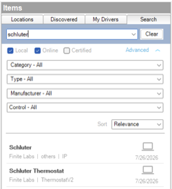
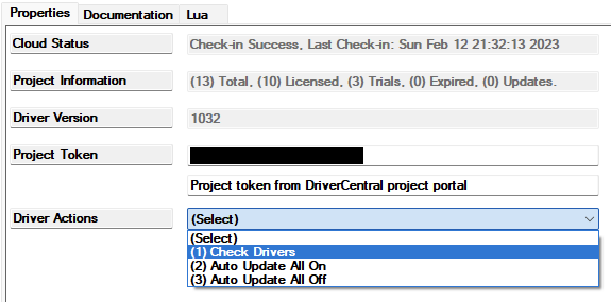

<!-- Copyright 2026 Finite Labs, LLC. All rights reserved. -->

______________________________________________________________________

# Overview

<!-- #ifndef DRIVERCENTRAL -->

> DISCLAIMER: This software is neither affiliated with nor endorsed by either
> Control4 or Schluter-Systems.

<!-- #endif -->

Integrate [Schluter DITRA-HEAT-E-WiFi](https://www.schluter.com) floor-heating
thermostats into Control4. This account driver signs in to your Schluter
DITRA-HEAT WiFi account, discovers every thermostat on it, and exposes each one
as a connection you bind to a companion **Schluter Thermostat** driver, which
appears in Control4 as a native thermostat with setpoint, mode, and schedule
control.

Schluter DITRA-HEAT is built on the OJ Electronics cloud platform, so this
driver talks to the same REST API the Schluter DITRA-HEAT WiFi app uses.

# Index

- [System Requirements](#system-requirements)
- [Included Drivers](#included-drivers)
  - [Schluter](#schluter)
  - [Schluter Thermostat](#schluter-thermostat)
- [Compatibility](#compatibility)
- [Installer Setup](#installer-setup)
  <!-- #ifdef DRIVERCENTRAL -->
  - [DriverCentral Cloud Setup](#drivercentral-cloud-setup)
  <!-- #endif -->
  - [Driver Installation](#driver-installation)
  - [Driver Setup](#driver-setup)
    - [Driver Properties](#driver-properties)
      - [Cloud Settings](#cloud-settings)
      - [Account Settings](#account-settings)
      - [Driver Settings](#driver-settings)
    - [Driver Actions](#driver-actions)
  - [Programming Reference](#programming-reference)

<!-- #ifdef DRIVERCENTRAL -->

- [Developer Information](#developer-information)

<!-- #endif -->

- [Support](#support)
- [Changelog](#changelog)

# System Requirements

- Control4 OS 3.3.0 or later
- A Schluter DITRA-HEAT-E-WiFi account with at least one thermostat set up in
  the [Schluter DITRA-HEAT WiFi app](https://ditra-heat-e-wifi.schluter.com)
- Internet access from the Control4 controller

# Included Drivers

## Schluter

The account driver, and the driver to add first. Enter your Schluter DITRA-HEAT
WiFi account email and password and it signs in to the cloud, discovers every
thermostat on the account, and creates a connection for each one. The **Schluter
Thermostat** drivers bind to those connections, so the account driver is the
only place credentials are entered and the only cloud connection that is opened.

**Key features:**

- Cloud sign-in with your Schluter DITRA-HEAT WiFi email and password
- Automatic discovery of every thermostat on the account
- One connection per thermostat, each bound to a companion thermostat driver
- Real-time state updates via the cloud's push notifications (no polling delay)

## Schluter Thermostat

The companion driver. Add one per physical thermostat and bind it to a
thermostat connection on the account driver. Each one appears in Control4 as a
native thermostat with setpoint, mode, and schedule control.

**Key features:**

- Setpoint, Heat/Off mode, and hold control
- Full weekly schedule read and edit through the native Control4 thermostat
  scheduling UI
- Temperature values communicated in Celsius, with the Control4 proxy handling
  display conversion to the project's configured scale

# Compatibility

This driver works with Schluter DITRA-HEAT-E-WiFi thermostats (DITRA-HEAT-E-RS1
/ DITRA-HEAT-E-RT1) managed through the Schluter DITRA-HEAT WiFi app. Because
Schluter DITRA-HEAT shares the OJ Electronics cloud platform with sibling
brands, the underlying API is the same one used by those apps.

If you have a model that works and is not listed, please
[open an issue](https://github.com/finitelabs/control4-schluter/issues/new) so
it can be added.

# Installer Setup

> ⚠️ Only a **_single_** Schluter account driver instance is required per
> Schluter account. Add one **Schluter Thermostat** driver per physical
> thermostat.

<!-- #ifdef DRIVERCENTRAL -->

## DriverCentral Cloud Setup

> If you already have the
> [DriverCentral Cloud driver](https://drivercentral.io/platforms/control4-drivers/utility/drivercentral-cloud-driver/)
> installed in your project you can continue to
> [Driver Installation](#driver-installation).

This driver relies on the DriverCentral Cloud driver to manage licensing and
automatic updates. If you are new to using DriverCentral you can refer to their
[Cloud Driver](https://help.drivercentral.io/407519-Cloud-Driver) documentation
for setting it up.

<!-- #endif -->

## Driver Installation

Driver installation and setup are similar to most other ip-based drivers. Below
is an outline of the basic steps for your convenience.

<!-- #ifdef DRIVERCENTRAL -->

1. Download the latest `control4-schluter.zip` from
   [DriverCentral](https://drivercentral.io/platforms/control4-drivers/utility/schluter).

1. Extract and
   [install](https://www.control4.com/help/c4/software/cpro/dealer-composer-help/content/composerpro_userguide/adding_drivers_manually.htm)
   all `.c4z` files.

1. Use the "Search" tab to find the "Schluter" driver and add it to your
   project.
    

1. Select the newly added driver in the "System Design" tab. You will notice
   that the `Cloud Status` reflects the license state. If you have purchased a
   license it will show `License Activated`, otherwise `Trial Running` and
   remaining trial duration.

1. You can refresh license status by selecting the "DriverCentral Cloud" driver
   in the "System Design" tab and perform the "Check Drivers" action.
    

1. Configure the [Account Settings](#account-settings) with your Schluter email
   and password.

1. After a few moments the [`Driver Status`](#driver-status-read-only) will
   display `Connected` with the number of thermostats found. If it fails, set
   the [`Log Mode`](#log-mode--off--print--log--print-and-log-) property to
   `Print` and re-enter the credentials, then check the Lua output window for
   details.

1. For each thermostat you want to control, use the "Search" tab to add a
   "Schluter Thermostat" driver. In the "Connections" tab, select the "Schluter"
   driver and bind each discovered thermostat to a "Schluter Thermostat" driver.

<!-- #else -->

1. Download the latest `control4-schluter.zip` from
   [Github](https://github.com/finitelabs/control4-schluter/releases/latest).

1. Extract and
   [install](https://www.control4.com/help/c4/software/cpro/dealer-composer-help/content/composerpro_userguide/adding_drivers_manually.htm)
   all `.c4z` files.

1. Use the "Search" tab to find the "Schluter" driver and add it to your
   project.
    

1. Configure the [Account Settings](#account-settings) with your Schluter email
   and password.

1. After a few moments the [`Driver Status`](#driver-status-read-only) will
   display `Connected` with the number of thermostats found. If it fails, set
   the [`Log Mode`](#log-mode--off--print--log--print-and-log-) property to
   `Print` and re-enter the credentials, then check the Lua output window for
   details.

1. For each thermostat you want to control, use the "Search" tab to add a
   "Schluter Thermostat" driver. In the "Connections" tab, select the "Schluter"
   driver and bind each discovered thermostat to a "Schluter Thermostat" driver.

<!-- #endif -->

Each companion driver includes its own documentation accessible from within
Composer Pro. Refer to the **Schluter Thermostat** driver documentation for its
property, connection, and programming reference.

## Driver Setup

### Driver Properties

#### Cloud Settings

<!-- #ifdef DRIVERCENTRAL -->

##### Cloud Status (read-only)

Displays the DriverCentral cloud license status.

##### Automatic Updates \[ Off | **_On_** \]

Enables or disables automatic driver updates via DriverCentral.

<!-- #else -->

##### Automatic Updates \[ Off | **_On_** \]

Enables or disables automatic driver updates from GitHub releases.

##### Update Channel \[ **_Production_** | Prerelease \]

Sets the update channel considered during automatic updates from GitHub
releases.

<!-- #endif -->

#### Account Settings

##### Email

The email address for your Schluter DITRA-HEAT WiFi account.

##### Password

The password for your Schluter DITRA-HEAT WiFi account.

##### Login Status (read-only)

Displays the account sign-in state (e.g. `Logging in...`, `Logged In`, or an
error message such as `Invalid username or password`).

#### Driver Settings

##### Driver Status (read-only)

Displays the current status of the driver (e.g. `Connected (2 thermostats)`).

##### Driver Version (read-only)

Displays the current version of the driver.

##### Log Level \[ 0 - Fatal | 1 - Error | 2 - Warning | **_3 - Info_** | 4 - Debug | 5 - Trace | 6 - Ultra \]

Sets the logging level. Default is `3 - Info`.

##### Log Mode \[ **_Off_** | Print | Log | Print and Log \]

Sets the logging mode. Default is `Off`.

### Driver Actions

<!-- #ifndef DRIVERCENTRAL -->

#### Update Drivers

Trigger the driver to update from the latest release on GitHub, regardless of
the current version.

<!-- #endif -->

#### Refresh Thermostats

Re-reads the account and refreshes the discovered thermostats and their
connection bindings.

#### Reconnect

Signs out and logs back in to the Schluter cloud without touching connection
bindings or cached thermostats. Use this to recover from a stuck session without
losing programming.

#### Reset Driver

> ⚠️ This will reset all connection bindings and delete any programming
> associated with them.

Signs out, removes all dynamically created thermostat connections, and signs
back in to rediscover from scratch. Useful if thermostats were added, removed,
or renamed on the account.

**Parameters:**

- **Are You Sure?** \[ **_No_** | Yes \] - Confirmation to reset the driver.

## Programming Reference

Once signed in, the driver creates one **provider** connection per thermostat on
the account (binding class `SCHLUTER_THERMOSTAT`), named after the thermostat's
room. Bind each to a **Schluter Thermostat** companion driver; that companion
exposes the standard Control4 thermostat proxy for programming (setpoint, mode,
schedule, temperature). This account driver has no directly programmable
variables of its own. All thermostat control and feedback is on the companion.

<!-- #ifdef DRIVERCENTRAL -->

# Developer Information

Copyright © 2026 Finite Labs LLC

All information contained herein is, and remains the property of Finite Labs LLC
and its suppliers, if any. The intellectual and technical concepts contained
herein are proprietary to Finite Labs LLC and its suppliers and may be covered
by U.S. and Foreign Patents, patents in process, and are protected by trade
secret or copyright law. Dissemination of this information or reproduction of
this material is strictly forbidden unless prior written permission is obtained
from Finite Labs LLC. For the latest information, please visit
https://drivercentral.io/platforms/control4-drivers/utility/schluter

<!-- #endif -->

# Support

<!-- #ifdef DRIVERCENTRAL -->

If you have any questions or issues integrating this driver with Control4, you
can contact us at
[driver-support@finitelabs.com](mailto:driver-support@finitelabs.com) or
call/text us at [+1 (949) 371-5805](tel:+19493715805).

<!-- #else -->

If you have any questions or issues integrating this driver with Control4, you
can file an issue on GitHub:

https://github.com/finitelabs/control4-schluter/issues/new

<!-- #endif -->

<!-- #embed-changelog -->
